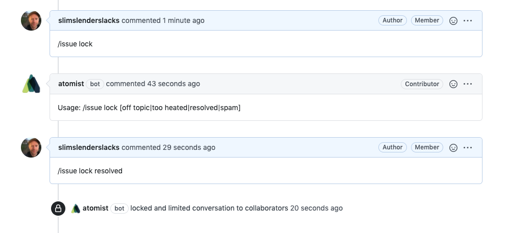

When interacting with GitHub, developers often perform the same, multiple tasks
in quick succession. For example, when you push a new branch, you often then
open a pull request. Another example is when you create or comment on an issue
and then add or remove a label. And sometimes, there are things you'd like to do
when interactive with GitHub that you just can't. For example, sending a Slack
direct message to someone from a pull request review or comment. This skill
makes all this and much more possible. Using simple commands in your commit
messages and/or issue/pull request comments, you can

-   Create a pull request directly from your commit message to the new branch
-   Automatically add labels to an issue or pull request based on comments
-   Notify a Slack channel about a commit
-   Close a pull request from a commit comment
-   Mark a draft pull request as ready to review from a commit comment
-   Notify a Microsoft Teams user about a pull request
-   Lock or unlock an issue from a comment

### Use commit message to create a draft pull request against the default branch

For example, to create a draft pull request from a branch, just include a commit
on the branch with the text `/pr --title 'My Title' --draft`.

```
$ git checkout -b my-feature
$ git commit -m "My feature changes" -m "/pr --title 'My Title' --draft"
$ git push origin my-feature
```

Once the push completes, the skill will create a new draft pull request against
the repository's default branch on your behalf. Note that this requests the pull
request creation in draft mode, essentially marking it as not yet ready to be
reviewed.

In the example above, we did not put the `/pr` command on the first line of the
commit message. This means that it will not show up in the "short" format of the
commit log. Users may choose remove these command lines during squash, or
rebasing, the branch commits.

### Use commit message to create a pull request against specific branch

When you push a commit to a branch, and you're ready to raise a pull request,
add the following command to any commit message on the branch.

```
/pr --title 'any title surrounded by quotes' --base target-branch-ref --label auto-merge-method:squash
```

This is useful when you are committing a new branch. You can push and create the
pull request in one step. The `--label` flag is also optional. The above label
tells another one of our skills,
[Auto-Merge Pull Request](https://go.atomist.com/catalog/skills/atomist/github-auto-merge-skill),
to squash commits before merging.

### Notify a user or channel in chat

To notify someone or an entire channel about a commit, issue, or pull request,
you can use the `/cc` command in your commit message or issue/pull request
comment/description. It is common to @-mention GitHub users in issues and pull
requests. This command provides a higher priority means of getting someone's
attention.

To send a message about an issue to a whole channel, use `#CHANNEL`. To send a
direct message to a single user, use `@USER`.

To notify the channel "developers" about a critical issue, just add a comment to
the issue that has the following text somewhere in the comment.

```
This comment is interesting to developers.

/cc #developers
```

To send a direct message to "alyssa" about a commit relevant to her, include
`/cc @alyssa` in the commit message.

```
$ git commit -m 'Unblocks Alyssa' -m '/cc @alyssa'
```

_For this command to work, a chat integration must be enabled in the
configuration._

### Create an issue from a commit message

You can use the `/issue create` command to create a new issue from a commit
message.

```
$ git commit -m 'Adding Feature X' \
    -m '/issue create --title "Add documentation" --assignee alyssa --assignee john --label documentation'
```

### Close a pull request

When committing to a branch with an open pull request, you can close any open
pull requests associated with this branch by including the `/pr close` command
in the commit message. To close only pull requests against a specific branch,
you can use the `--base` option.

```
$ git commit -m 'Never mind' -m '/pr close --base main'
```

This can be useful when you've realized that the branch needs more work and
you'd like to retract the pull request. We are planning on adding a `/pr draft`
to move the pull request back to draft mode. Unfortunately, GitHub does not seem
to provide api access to this feature yet.

### Mark a draft pull request as ready for review

Mark an open, draft pull request on this branch as ready for review by adding
the `/pr ready` command to your commit message.

```
$ git commit -m 'Completed implementation' -m '/pr ready'
```

You can also do this in a pull request comment.

```
This is ready now.

/pr ready
```

This is great complement to the ability to create pull requests in draft mode.
Create draft pull requests early, and then mark them ready to review later.

### Combining slash commands

Any of the above commands can be combined. So, for example, a commit message
could create a pull request _and_ notify chat users.

```
$ git commit -m 'Adding feature X' \
    -m 'This is a backwards compatible change to the segments API.'
	-m '/pr --title "feature X" --base main --draft --label api --label segment'
	-m '/cc #segment-team'
```

### Add or remove labels on an issue or pull request

When commenting on an issue or pull request, you can assign labels to the
issue/pull request with the `/label` command.

```
This is ready to go.

/label bug,documentation,next
```

If any of the labels you request are not present in the repository, this skill
first adds them and then assigns them to the issue/pull request. If you've ever
tried to manage a set of labels across a bunch of repositories, you know how
helpful that can be.

You can also remove labels.

```
Wait, this isn't a bug.

/label --rm bug
```


### Lock or unlock an issue

You can lock an issue by including the `/issue lock` command in an issue
comment.

```
Let's take a breather.

/issue lock [off topic|too heated|resolved|spam]
```

You can also unlock an issue with the `/issue unlock` command.

```
/issue unlock
```


