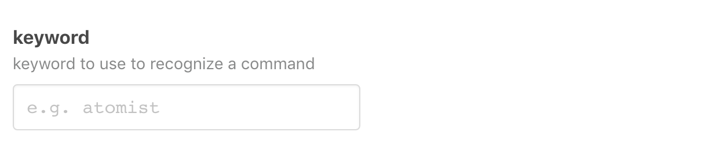

# `atomist/git-chatops-skill`

<!---atomist-skill-readme:start--->

Run commands from git commit messages.

# What it's useful for

When you know that you want to trigger a command after Push, embed the command in a Commit message and just push.

For example, if you'd like to create a Pull Request after a successful Push, include a command in your Commit Message:

```
17:56 $ git commit -m "$(cat <<-END
> this is my commit message
> but I can also add a command
>
> /atomist pr --title 'my title' --base master
> END
> )"
```

When configuring this skill, you can change the keyword used to trigger a command to something else.  All keywords
must start with a `/`

```
/<keyword> pr --title 'my title' --base master
```

# Before you get started

Connect and configure these integrations:

1. **GitHub**
2. **Slack** (optional)

The **GitHub** integration must be configured in order to use this skill. At least one repository must be selected. 
We recommend connecting the **Slack** integration.

# How to configure

You can enable this skill without configuring any target versions.  In this mode, the skill will collect
data about your library versions, but will take no action.  Simply select the set of
repositories that should be scanned.

1. **Configure the keyword used to recognize commands**

    

    Switch the default keyword from `atomist` to something customized for your team.
 
2. **Determine repository scope**

    

    By default, this skill will be enabled for all repositories in all organizations you have connected.

    To restrict the organizations or specific repositories on which the skill will run, you can explicitly choose 
    organization(s) and repositories.
    

## How to use Update Clojure Tools Dependencies

1.  **Create PRs from a Commit message** 

    When you push a Commit to a branch, and you're ready to raise a PR, add a message to raise that PR right in your
    Commit message.  You can include this anywhere in the message:
    
    ```
    /<keyword> pr --title 'any title surrounded by quotes' --base target-branch-ref
    ```
    
2.  **Add a Comment to an open PR**

    When you check in to a branch with an open Pull Request, you can use commit messages to add additional 
    comments to that Pull Request. 

    ```
    /<keyword> pr --base master --comment
    ```
    
    The rest of the commit message will be transcribed into the PR comment body.

3.  **Label Issues from Comments**

    When commenting on an issue, you can add labels to that issue by commenting directly in the Issue:
    
    ```
    /<keyword> label label1,label2
    ```
    
    You can also remove labels from an Issue:
    
    ```
    /<keyword> label --rm label1
    ```

4.  **CC a Slack channel or User**

    This command works with our Slack integration.
    
    ```
    /<keyword> cc #<slack-channel>
    /<keyword> cc @<slack-user>
    ```
    
    The above commands can be added to either Comments, or Commit messages.  A link to the Commit, or to the Comment,
    will be sent to the Channel or User.  Slack channels must be prefixed by `#`, and Slack users must be prefixed by `@`.

To create feature requests or bug reports, create an [issue in the repository for this skill](https://github.com/atomist-skills/git-chatops-skill/issues). 
See the [code](https://github.com/atomist-skills/git-chatops-skill) for the skill.

<!---atomist-skill-readme:end--->

---

Created by [Atomist][atomist].
Need Help?  [Join our Slack workspace][slack].

[atomist]: https://atomist.com/ (Atomist - How Teams Deliver Software)
[slack]: https://join.atomist.com/ (Atomist Community Slack) 
