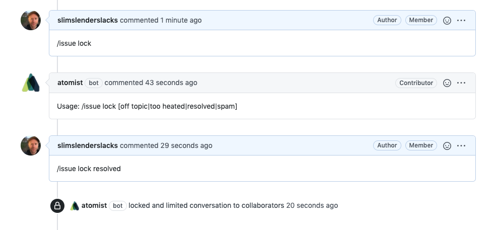

# How to configure

To make the slash commands available in a repository, it must be enabled below. We recommend enabling this skill for
all repositories.

1. **Determine repository scope**

    

    By default, this skill will be enabled for Issues, and Commits on all repositories that you have connected.

    To restrict the organizations or repositories on which the skill will run, restrict the skill to a subset
    of your repositories.

## How to use

### Add commands to Commit messages

1.  **Create a pull request from a commit message**

    When you push a commit to a branch, and you're ready to raise a pull request, add the following command any
    where in your commit message.

    ```
    /pr --title 'any title surrounded by quotes' --base target-branch-ref --draft
    ```

    This is useful when you are committing a new branch. You can push and create the pull request in one step.
    Note that this requests the pull request creation in draft mode so it is not yet ready to be reviewed.

2.  **Notify a User or Channel in Slack**

    Highlight this Commit for a User or a Slack channel, by mentioning them in the body of the commit message.  
    This command requires that the Slack integration is enabled for the team.

    ```
    Fixes Issue X
    /cc #channel
    ```

    Use the `@user` syntax to notify individual users.

    ```
    Fixes Issue Y
    /cc @alyssa
    ```

3.  **Create an Issue**

    ```
    Adding Feature X
    /issue create --title "TODO: I need some help documenting this" --assignee alyssa --assignee john --label documentation
    ```

4.  **Close a Pull Request**

    When committing to a branch with an open pull request, you can close any open pull requests associated with this branch:

    ```
    /pr close
    ```

    or just the one that targets a specific branch using:

    ```
    /pr close --base master
    ```

    This can be useful when you've realized that the branch needs more work and you'd like to retract the pull request.  
    We are planning on adding a `/pr draft` to move the pull request back to draft mode. Unfortunately, github does not
    seem to provide api access to this feature yet.

5.  **Mark a draft Pull Request as Ready for review**

    Mark an open PR on this branch as ready for review with:

    ```
    /pr ready
    ```

    This is great complement to the ability to create pull requests in draft mode. Create draft pull requests early,
    and then mark them ready to review later.

All of the above command can be combined. So a Commit message could create a pull request, and notify
Slack users in the same commit message.

```
Adding feature X

This is a backwards compatible change to the segments api
/pr --title 'feature X' --base main --draft --label api --label segment
/cc #segment-team
```

### Add commands to Issue or Pull Request Comments

We can also add commands to the comments of any issue, or pull request. The commands that make the most
sense in the context of an issue comment are listed here:

1.  **Add or remove labels**

    When commenting on an issue, or on a pull request, you can add labels by adding commands to the comment:

    ```
    /label label1,label2
    ```

    You can also remove labels:

    ```
    /label --rm label1
    ```

2.  **Make a draft Pull Request ready**

    Mark the current pull request as ready for review by including the command:

    ```
    /pr ready
    ```

3.  **Lock or unlock an Issue**

    Mark the current issue as locked

    ```
    /issue lock [off topic|too heated|resolved|spam]
    ```

    or unlock it

    ```
    /issue unlock
    ```

    

4.  **Notify a Slack channel or user**

    Similar to above, you can highlight Issues for users or channels. This only works if our Slack integration
    has been enabled.

    ```
    /cc #<slack-channel>
    /cc @<slack-user>
    ```

To create feature requests or bug reports, create an [issue in the repository for this skill](https://github.com/atomist-skills/github-slash-commands-skill/issues).
See the [code](https://github.com/atomist-skills/github-slash-commands-skill) for the skill.
